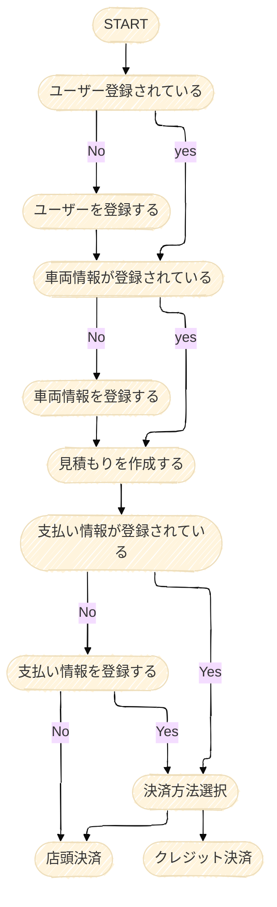

# Car Maintenance Estimate App

## はじめに

私はガソリンスタンドで働いており、現在使用している多くの管理ツールには満足しています。しかし、最近気になる変化があります。それは「新車検証」の普及です。この新車検証にはICチップが内蔵されており、車両情報をデジタル形式で読み取ることが可能です。また、国土交通省が提供する車検証アプリを使えば、スマートフォンを通じて簡単に車両情報を確認できます。
この技術の可能性に着目し、APIを学びながら「車両情報からメンテナンス費用の見積もりを行い、その場で購入ができるシステム」の開発を思いつきました。このシステムを通じて、ガソリンスタンド業界がデジタル管理へと移行し、顧客がより便利に車両の維持管理を行えるようになることを目指しています。

## 国土交通省の車検証アプリについて

車検証アプリから車両情報を取得するAPIとしての利用は、国土交通省への申請が必要ですが、個人としては利用が難しい面があります。ただし、アプリ自体は個人でも利用可能であり、店頭での対面商談時に車検証を登録し、お客様が自宅で利用できるようにすることも一つの手段です。

# 使用技術一覧

 
 

# サービス概要

### ユーザーが利用できること

* ユーザーがユーザー情報を登録し、車検証アプリや車両情報を直接入力してユーザー情報と車両情報を登録します。
* 登録した車両情報をもとに車両に必要なメンテンナンスの情報が呼び出され登録されます。
* 見積もりを作成時には、メンテナンス情報から適合のグレードや数量が自動で抽出されるので車両に適した商品で簡単に見積もりを作成することができます。
* クレジット情報を登録することでその場で決済することができます。また、店頭での点検にて改めて購入したい場合は店頭支払いも可能です。
* 作成した見積もりはDBに保存されあとで見積もり情報を作成日時で取得し、確認することができます。

### 管理者が利用できること

* メンテナンス情報を追加登録・更新・削除ができます。
* 新しくメンテナンス情報を追加登録できます。
* 各メンテナンス商品・商品カテゴリーを追加登録や修正・削除ができます。

 
 

# 補足

* 車両情報：車の年式・型式・メーカーなど
* メンテナンス情報：オイル交換時のオイルの粘度や数量、交換部品の詳細
* メンテナンス商品：エンジンオイルやオイルフィルターなど、洗車も含む

 
 

# API設計とエンドポイントについて

## ユーザーがアクセスできるエンドポイント

| method |    end_point     |    description    |
|:------:|:----------------:|:-----------------:|
|  POST  |      /users      |    ユーザー情報を登録する    |
|  GET   |      /users      |    ユーザー情報を取得する    |
|  PUT   |      /users      |    ユーザー情報を更新する    |
| DELETE |      /users      |    ユーザー情報を削除する    |
|  POST  |     /vehicle     |     車両情報を登録する     |
|  GET   |     /vehicle     |     車両情報を取得する     |
| DELETE |     /vehicle     |     車両情報を削除する     |
|  POST  |    /estimate     |  メンテナンス見積もりを登録する  |
|  GET   |    /estimate     | メンテナンス見積もり情報を取得する |
|  PUT   |    /estimate     | メンテナンス見積もり情報を修正する |
| DELETE |    /estimate     | メンテナンス見積もり情報を削除する |
|  POST  |     /payment     |    支払い情報を登録する     |
|  GET   |     /payment     |    支払い情報を取得する     |
| DELETE |     /payment     |    支払い情報を削除する     |
|  POST  | /payment/confirm |       購入する        |

上記のエンドポイントはAdminユーザーもすべてアクセスできる。

 
 

## Adminユーザーのみがアクセスできるエンドポイント

| method |     end_point     |     description      |
|:------:|:-----------------:|:--------------------:|
|  POST  |   /admin/login    |    Adminユーザーのログイン    |
|  POST  |   /maintenance    |   車両メンテナンス情報を登録する    |
|  PUT   |   /maintenance    |   車両メンテナンス情報を更新する    |
| DELETE |   /maintenance    |   車両メンテナンス情報を削除する    |
|  POST  |     /product      |    メンテナンス商品を登録する　    |
|  PUT   |     /product      |   メンテナンス商品情報を更新する    |
| DELETE |     /product      |   メンテナンス商品情報を削除する    |
|  GET   |     /product      |   メンテナンス商品情報を検索する    |
|  POST  | /product/category |  メンテナンス商品カテゴリーを登録する  |
|  PUT   | /product/category | メンテナンス商品カテゴリー情報を更新する |
| DELETE | /product/category | メンテナンス商品カテゴリー情報を削除する |
|  GET   | /product/category | メンテナンス商品カテゴリー情報を検索する |

 
 

# 登録から支払いまでのフロー

## ユーザーが見積もりから購入するまでのフローですが、ユーザー側もログイン機能を作成するか検討中

1. ユーザー登録を行います
2. 車両情報を登録します
3. 希望のメンテナンスを見積もります。
4. その場で購入したい場合は支払い情報を登録します。
5. 店頭決済を希望される場合は支払い情報なしで確定できます。

# ER図

# ガントチャートにてスケジュール化

