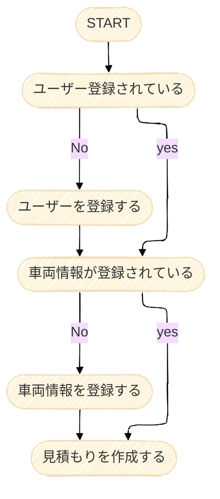

# Car Maintenance Estimate App

## はじめに

私はガソリンスタンドで勤務しており、すでに顧客管理ツールは導入されていますが、メンテナンス作業を行うたびに
車種ごとに適合するメンテナンスをメンテナンスカタログなどで確認し、見積もりを作成する必要がありました。

そのため、オイルの数量ミスや、車両に適合しないメンテナンスの登録ミスが発生するリスクがありました。
このような作業の非効率さとヒューマンエラーを防ぐために、車両情報とメンテナンス情報を一元管理できるシステムが必要だと感じていました。

そこで本アプリケーションでは、
車両情報を登録し、適切なメンテナンス情報を基に見積もりを簡単に作成できるシステムを開発しました。
ユーザーは車両情報を登録し、必要なメンテナンスを選ぶだけで、効率的かつ正確に見積もりを作成することが可能です。

# 使用技術一覧

 
 

# サービス概要

### 管理者が利用できること

* 顧客情報を登録し、車両情報を直接入力してユーザー情報と車両情報を登録します。
* 登録した車両情報をもとに車両に必要なメンテンナンスの情報が呼び出され登録されます。
* 見積もりを作成時には、メンテナンス情報から適合のグレードや数量が自動で抽出されるので車両に適した商品で簡単に見積もりを作成できます。
* メンテナンス情報を追加登録・更新・削除ができます。
* 作成した見積もりはDBに保存されあとで見積もり情報を作成日時で取得し、確認できます。

### メンテナンス商品マスタを追加実装可能

* 新しくメンテナンス情報を追加登録できます。
* 各メンテナンス商品・商品カテゴリーを追加登録や修正・削除ができます。

 

# 補足

* 車両情報：車の年式・型式・メーカーなど
* メンテナンス情報：オイル交換時のオイルの粘度や数量、交換部品の詳細
* メンテナンス商品：エンジンオイルやオイルフィルターなど、洗車も含む

 
 

# API設計とエンドポイントについて

## 一般アカウントがアクセスできるエンドポイント

| method | end_point  |    description    |
|:------:|:----------:|:-----------------:|
|  POST  | /customers |    ユーザー情報を登録する    |
|  GET   | /customers |    ユーザー情報を取得する    |
|  PUT   | /customers |    ユーザー情報を更新する    |
| DELETE | /customers |    ユーザー情報を削除する    |
|  POST  |  /vehicle  |     車両情報を登録する     |
|  GET   |  /vehicle  |     車両情報を取得する     |
| DELETE |  /vehicle  |     車両情報を削除する     |
|  POST  | /estimate  |  メンテナンス見積もりを登録する  |
|  GET   | /estimate  | メンテナンス見積もり情報を取得する |
|  PUT   | /estimate  | メンテナンス見積もり情報を修正する |
| DELETE | /estimate  | メンテナンス見積もり情報を削除する | 

上記のエンドポイントはAdminユーザーもすべてアクセスできる。

## リクエストパラムによる検索機能

| method |           end_point            |           description            |
|:------:|:------------------------------:|:--------------------------------:|
|  POST  | /customers/phone/{phoneNumber} |  電話番号を指定してユーザー情報を取得できます。（完全一致）   |
|  POST  |    /customers?email={email)    | メールアドレスを指定してユーザー情報を取得できます。（完全一致） |
|  POST  |     /customers?name={name}     |  ユーザー名前を指定してユーザー情報を取得できます。（部分）   |
|  POST  |     /customers?kana=kana}      | ユーザーのよみがなを指定してユーザー情報を取得できます。（部分） |

 

## 管理者アカウントがアクセスできるエンドポイント

| method |     end_point     |     description      |
|:------:|:-----------------:|:--------------------:|
|  POST  |   /maintenance    |   車両メンテナンス情報を登録する    |
|  PUT   |   /maintenance    |   車両メンテナンス情報を更新する    |
| DELETE |   /maintenance    |   車両メンテナンス情報を削除する    |
|  POST  |     /product      |    メンテナンス商品を登録する　    |
|  PUT   |     /product      |   メンテナンス商品情報を更新する    |
| DELETE |     /product      |   メンテナンス商品情報を削除する    |
|  GET   |     /product      |   メンテナンス商品情報を検索する    |
|  POST  | /product/category |  メンテナンス商品カテゴリーを登録する  |
|  PUT   | /product/category | メンテナンス商品カテゴリー情報を更新する |
| DELETE | /product/category | メンテナンス商品カテゴリー情報を削除する |
|  GET   | /product/category | メンテナンス商品カテゴリー情報を検索する |

 
 

# 登録から支払いまでのフロー

## ユーザーが見積もり作成までのフロー

1. ユーザー登録を行います
2. 車両情報を登録します
3. 希望のメンテナンスを見積もります。

# ER図

# ガントチャートにてスケジュール化

